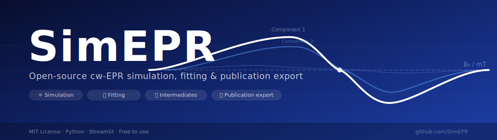

<p align="center">
  
</p>

<p align="center">
  <a href="https://simepr.streamlit.app"></a>
</p>

<p align="center">
  
  
  
  
</p>

---

> **🌐 Live web app (no installation):** [https://simepr.streamlit.app](https://simepr.streamlit.app) — open in any browser, upload your EPR data, fit and export instantly.

> **🔒 Code access:** This repository is private. To request access to the source code for research or collaboration, email **u7929894@anu.edu.au** with your name, institution, and intended use.

---

**SimEPR** is a free Streamlit GUI for **general cw-EPR** spectrum simulation, fitting, model comparison, and publication-ready export — covering isotropic radicals through anisotropic, high-spin, and zero-field-split systems. It works for any solvent/matrix, catalyst/material, atmosphere, spin probe, or reaction condition.

## Scientific Scope

SimEPR couples two engines behind one interface:

- **Fast analytical engine** — isotropic, fast-tumbling radicals (scalar g and A), first-derivative Lorentzian/Gaussian/pseudo-Voigt lineshapes.
- **General spin-Hamiltonian engine** — full matrix diagonalisation with **powder orientation averaging** for:
  - Anisotropic **g-tensor** (axial / rhombic) and **hyperfine A-tensor** (collinear or Euler-rotated)
  - **High-spin** systems, S > ½ (e.g. Mn(II), Fe(III), Cr(III))
  - **Zero-field splitting** (D, E) — triplets, biradicals, high-spin metals
  - **Multifrequency** EPR (X-, Q-, W-band)

It solves the spin Hamiltonian `H/h = (μ_B/h)·B·g·S + Σ S·A_k·I_k + D(S_z²−S(S+1)/3) + E(S_x²−S_y²)`, locating microwave-allowed transitions by diagonalisation and weighting them by orientation-dependent transition probabilities. Supported nuclei: ¹H, ²H, ¹³C, ¹⁴N, ¹⁵N, ¹⁹F, ³¹P, ²⁷Al, ⁵¹V, ⁵⁵Mn, ⁶³Cu, ⁶⁵Cu.

It further supports multi-component mixture fitting, model comparison by BIC/AIC, radical/intermediate assignment, field-axis calibration alignment, and transparent export of all fitted metrics and plotted data.

**Relationship to other tools.** SimEPR complements established packages such as [EasySpin](https://easyspin.org) and XSophe, which remain the reference for pulsed EPR, ENDOR/ESEEM, orientation-selective and global multifrequency fitting, and strain distributions. SimEPR prioritises free, zero-installation accessibility for cw simulation and fitting across a wide range of chemistries.

📄 **Full scientific paper:** [`docs/SimEPR_paper.pdf`](docs/SimEPR_paper.pdf) · [`docs/SimEPR_paper.docx`](docs/SimEPR_paper.docx)

## Install

```powershell
cd E:\Open-EPR-SimFit-GUI
py -3.11 -m pip install -r requirements.txt
```

## Run

```powershell
py -3.11 -m streamlit run app.py --server.port 8502
```

Or double-click `run_simepr.bat`.

## Citation

If SimEPR helps your work, cite the bundled white paper and software citation:

- `docs/WHITE_PAPER.md`
- `CITATION.cff`

Both are also downloadable from the GUI's White paper / citation tab.

## Custom Models

Users can upload custom model libraries in JSON, YAML, or CSV format from the Model builder tab. See `docs/CUSTOM_MODEL_FORMAT.md`.

## Roadmap

The white paper now includes a research-software roadmap covering DOI-linked release archives, curated reference spectra, uncertainty estimates, richer EasySpin tensor/powder export, time-series/catalyst-series batch processing, and powder-engine validation against reference cases.
